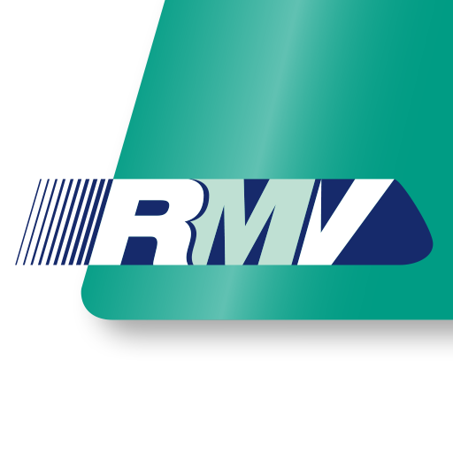

# 达姆简介

达姆全称达姆施塔特 (Darmstadt)，是一座位于德国黑森州南部的中型城市，控有莱茵河和美茵河交汇口三角洲以东的地域，自古以来即为黑森南部的中心城市，曾作为历史上黑森大公国的首都。

达姆施塔特北离法兰克福 (Frankfurt am Main) 27公里，海拔144米，面积122.09 km^2^，现在拥有人口159,207[^Population]，其中外籍人员占比大约16.7%，是位于法兰克福、威斯巴登和卡塞尔后黑森州第四大城市。

[^Population]: 截止2018.12.31日数据

鉴于多所高校根植于达姆施塔特，1997 年 8 月13 日黑森州内政部授予了达姆施塔特 “科学城 (Wissenschaftsstadt) ” 的称号。达姆施塔特共有大约 41,000 名学生。其中最具代表性的是成立于 1877 年的达姆施塔特工业大学，约有在校注册学生 26,000 名。紧接其后的是约有 13,000 名学生的达姆施塔特应用技术大学 (h_da) 。该校除了达姆施塔特校区以外，还在迪堡校区 (Campus Dieburg) 拥有 3000 名学生。除了这两所主要大学，达姆还拥有于 1851 年创办的音乐学院 Akademie für Tonkunst 以及创办于 1971 年的Evangelische Hochschule Darmstadt (EHD) 。

Darmstadt 建市于 672 年，历史悠久，市内遍布历史古迹，其中最具代表性的就是Luisenplatz。作为城市交通枢纽，达姆施塔特的几乎所有的公交 (Bus) 和有轨电车 (Straßenbahn) 线路都会在 Luisenplatz 交汇。矗立在广场中央的，是由 Georg Moller 为设计并于 1844 年建造的路德维希纪念碑。达姆施塔特被认为是新艺术运动的代表，可以追述到 1899 年恩斯特·路德维希大公建立的达姆施塔特艺术家村 (Kunstkolonie) 。

## 初到达姆交通

### 飞机到达

到达法兰克福机场 (Flughafen Frankfurt am Main) 后，你可以选择乘坐机场专线 (Bus Air / AirLiner) ，火车或者或者出租车的方式到达达姆施塔特。

机场专线始发站位于1号航站楼 (Terminal 1) 的14站台，途经 Flughafen Tor 3 以及 2 号航站楼 (Terminal 2) ，到达达姆市内后依次停靠 Mina-Rees-Straße，达姆主火车站 (HBF Damststadt) ，Luisenplatz 以及达姆会议中心 (Kongresszentrum Darmstadtium) 。首班发车时间为 04:44，每半小时一班，末班发车时间为 23:59[^AirLiner] 。 机场专线全程约 45 分钟，成人票价 8\. 75 欧，儿童 (6-14岁) 票价 6.70 欧，学生优惠票 3\. 80 欧元。

[^AirLiner]: 如有变动，请以当日实时信息为准。

火车可从机场的 Regional Bahnhof 搭乘 S8/S9 或 RE/RB 到达法兰克福火车总站后，换乘去往海德堡方向的 RB 或者去往曼海姆方向的 RE (去往曼海姆方向需注意火车的路线，周末以及节假日并不开行法兰克福经达姆至曼海姆的 RE) ，或者 S3 直达达姆。具体行车时刻表请查询莱茵美因地区交通联合体网站：[RMV](http://www.rmv.de/coremedia/generator/RMV) 或者德国联邦铁路网站：[Deutsch Bahn](http://www.bahn.de/p/view/index.shtml)。建议提前下载好应用 RMV App 或 DB Navigator。

### 火车到达

到达达姆火车总站后，可于正门 (东侧) 换乘公共汽车 H、K 或有轨电车 3、5、2、1 (1、2 路仅限工作日，周末节假日不开行) 前往市中心。换乘公共汽车时请注意行车方向。具体行车路线及时刻表请查询 RMV App 或直接问在火车站里的 Information 柜台。

    

