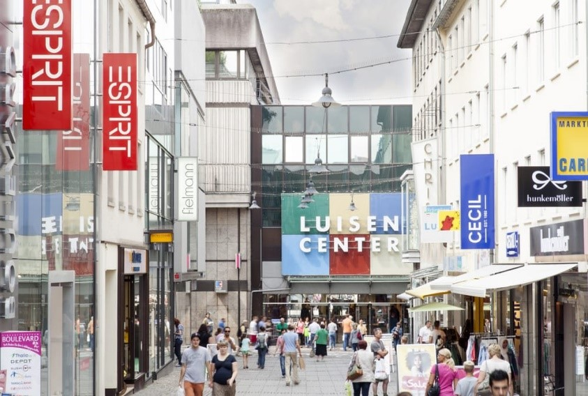
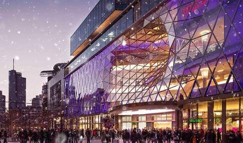
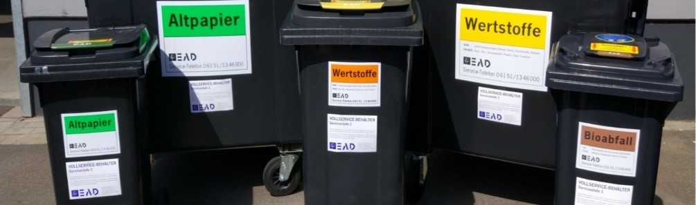
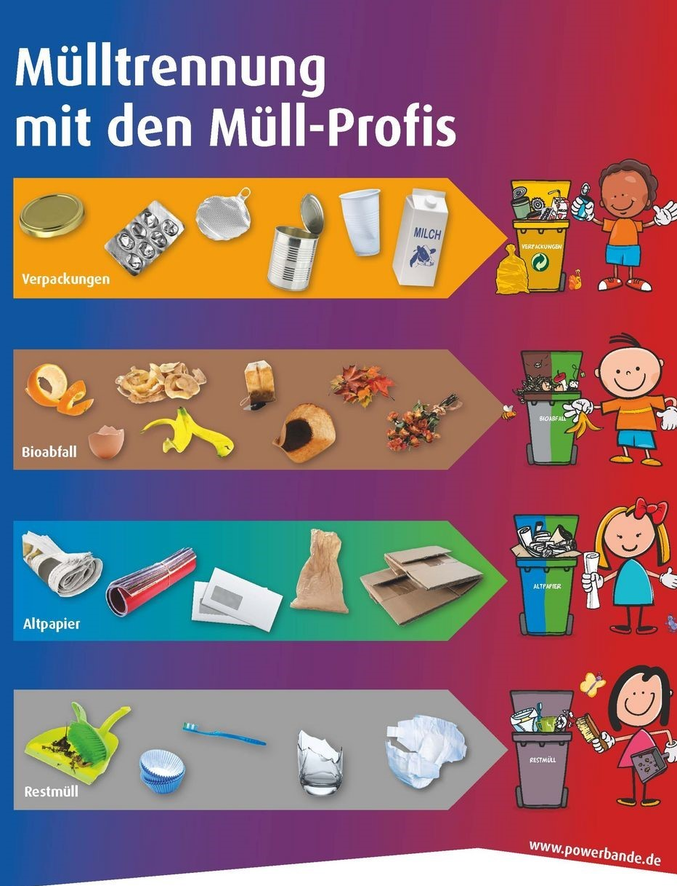
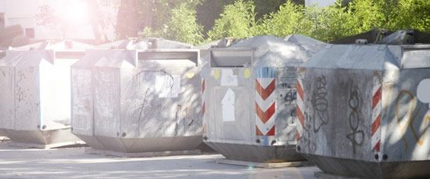
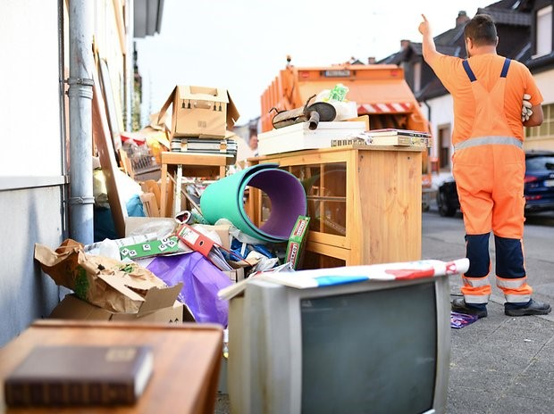

# 生活

本章围绕在达姆及周边买买买，吃吃吃，扔扔扔三大问题进行简单介绍，希望能满足同学日常所需。

## 购物

### 商圈  

本小节主要介绍达姆及周边几大商圈，在这些地方，步行范围内就可以买到大部分生活所需，逛街觅食好去处。

- **Luisenplatz 及附近**  
位于达姆中心，坐公交 Luisenplatz 站下即可，这里有服装店像 Zara，ESPRIT，HM，C&A，Mango，等等，电器店 Saturn，鞋店 Foot Locker 等等，人在达姆几年最常去的地方之一。
{align: "middle", width: "50%"}

- **Loop5  及附近**  
Loop 5 位于达姆市郊，Weiterstadt，Gutenbergstraße 3，主火车站乘坐公交车 WE 3 直达。6 万平米室内购物场地，超过百家店铺汇集于此，具体商铺信息可访问官网（[loop5.de](https://loop5.de/shops/)）。步行距离还有大型电器店 MediaMarkt，电脑城 ComputerMAX，大型户外运动产品卖场 McTREK Outdoor Sports，等等店铺卖场。 
{align: "middle", width: "75%"}

- **Zeil 大街，法兰克福**  
主火乘坐 S3 小火车，Hauptwache 站直达，自 19 世纪末起，Zeil 街就是德国最富盛名以及交易量最大的购物街, 尽管不在达姆，离达姆并不远。无论是各种奢侈品平价品，还是各国美食，各种需求总能得到满足。
{align: "middle", width: "100%"}

### 德国食品超市  

本小节主要介绍大家在日常生活最常见，也会去的最多的食品超市，大概分为三类，廉价超市，中型超市和大型超市。

- **平价超市**: 价格便宜，自家产品较多，购物环境较为一般，品类丰富但种类较为单一，经常会有打折品，代表超市：Lidl，Aldi，Netto，Penny，Nahkauf。

- **中型超市**: 相较以上平价超市，价格稍贵，但购物环境更好，种类更丰富，食材也更新鲜，代表超市：Rewe, Edeka, Tegut。如果对有机 bio 产品情有独钟，Alnatura 是个好去处。

- **大型超市**: 面积大，种类全，价格适中，活动多，有活动时候不比平价超市贵，但店面少，且在市郊，交通不是很方便，代表超市：Kaufland，Real。

### 外国食品超市  

身在德国，一颗中国胃却总需要告慰。德超食材尽管丰富，但仍有不够，这时候就需要在其他地域风格的超市里找些补充了，本小节介绍了达姆及附近外国超市 (相对德国)，以及其中可以获得的食材。

- **亚洲超市**  购买各种国内食材零食，以及日韩泰越调味品去处，推荐达姆市内 Luisenplatz 的 Kaufhof 负一层 Goasia ，或者法兰主火门口马路对面好人超市，均为中国人所开，店面较大种类丰富，售卖商品符合国人口味。  达姆还有一些其他较小的亚超。

- **俄国超市**  在俄超可以购买到很多德超买不到的猪肉部位，如猪耳猪舌猪蹄甚至整个猪头，还能买着牛肚儿，有更接近国内香肠的口味俄罗斯红肠，这里还能买到价格较为便宜且丰富的冷冻海产品。去俄超 (Mix Markt) 可乘坐 4 号线 5 号线 Kranistein 方向，Simensstrasse 站下。

- **土耳其超市**  在达姆可以看见很多土耳其超市，这里推荐 Yazgülü，公交 WE1，im Tiefensee 下车，或者 4，5，7 电车 Pallaswiesen 站下车走去。  可以买到新鲜羊肉，羊腿，羊小排，这里的牛肉，鸡肉散装售卖，相较德超便宜。还可以买到新鲜鱼虾蟹及其他海鲜。肉食爱好者好去处。

### 日化超市

主要售卖日化用品，平价药妆，化妆品，保健品，母婴，少量食品 ( 多为有机 )，代表超市：Dm，Rossmann。

### 礼品超市

售卖各种新奇礼品，如果朋友生日，有送礼物需求，或者单纯用些奇奇怪怪小东西装饰下家，可去转转。代表超市：Nanu-nana，Hegendubel。

## 饮食

### 食堂 (Mensa) 

达姆有四大学生食堂，分别在 Liwi 校区，Stadtmitte 校区，h_da 主教学楼下，以及 Dieburg，TU 和 Hochschule 食堂用彼此学生卡均能购餐。 每日具体菜单价格可以在学校食堂 app，Mensa-App 上查看。

学校食堂只在周一至周五提供早午餐，此外校内还有一些 Bistro, BAR，甚至 Biergarten，会提供面包，披萨，咖啡和糕点等，营业时间长短不一具体可参考学校食堂官网 [Hochschul Gastronomie](https://studierendenwerkdarmstadt.de/hochschulgastronomie/mensen-bistros/)。

### 餐厅

除了学校食堂和Bistro，也可以外面解决下吃饭问题，本小节介绍一些餐厅，可提供些选择与参考。

**德餐**  身在德国当然要去尝尝最正统的德国风味，大杯鲜啤酒，大猪肘酸菜，brezel，香肠薯条搭番茄酱等等，这里列达姆几家有年头，谷歌评分较高的德式餐厅:

- Ｇrohe Brauhaus ( k 线，3 号线，9 号线 Schulstrasse 下 )
- Restaurant Sitte (Grohe 马路对面 )
- Darmstädter Ratskelller Hausbrauerei (Schloss 站小广场中间最大那家老房子)

**中餐**  达姆中餐馆数目不多但各有卖点：

- 川辣炒菜店：龙门阵 (China Restaurant Klatsch & Tratsch);

- 麻辣烫店：麻辣隔壁 (China Restaurant Jin's Haus)；

- 家常口味炒菜店：冬冬 (happy wok asiafood darmstadt), 包吧 (Bao Bar home food)；

- 自助&烤肉店: 大可汗 (Restaurant KHAN- Mongolischer Grill)；

- 自助火锅店：新港鑫 (Neu Kong Fondue Restaurant) 

当然法兰有更多口味选择，具体可自行谷歌。

**其他**  
相较去以上餐厅，还有更适合日常常去的快餐店，那就是土耳其店和越南店。土耳其店不必多说，随处可见，什么时候饿了，进去点个 Dönner 啃，总能得到烤肉蔬菜沙拉以及面饼的同时满足。另一选择就是更符合亚洲口味，相较中餐厅更加惠民的越南店，在市中心区域，离图书馆近的主要有三家：

- ASIA EXPRESS (Schloss 站 Tegut 超市旁边 )；

- Asia Dang Dragon ( 市中心图书馆 Alexanderstrasse 站 Dieburger Str. 10)；

- Wok MAN (Roßdörfer Platz 站下车，马路对面 )。

## 垃圾分类  

相较国内垃圾分类才开始推广，方兴未艾，德国垃圾分类早已深入人心，自成体系，且已融入生活方方面面。 本章将具体介绍在达姆垃圾分类的原则，并将根据是否需要自己移动垃圾桶待垃圾回收公司回收，将垃圾分为一般垃圾和特殊垃圾。值得一提的是达姆及周围地区的垃圾处理统一由 EAD 公司处理，如以下解释有异议或不懂，一切以 EAD 官网为准：[EAD 官网](https://ead.darmstadt.de)

### 一般垃圾  

此类垃圾为在日常生活中最易产生的垃圾，垃圾回收公司会以户为单位发放不同垃圾桶，并以周/月为单位挨家挨户回收。这就需要在提前看好回收日期，并于回收当天将对应垃圾桶推至路边 ( 针对住私房，且需要履行相应义务的同学 )。具体回收日期可于网址: [Abfallkalender Darmstadt](https://ead.darmstadt.de/unser-angebot/privathaushalte/abfallkalender/) 查询，点击输入所居住街道号即可。

此类垃圾共分为四种：Wertstoffetonne ( 黄桶 )，Bioabfall ( 棕桶 )，Altpapier ( 绿桶 )，Restabfall ( 黑盖 )。如图，EAD会在每个垃圾桶上张贴对应桶应该装垃圾的种类名称。
{align: "middle", width: "100%"}

具体每类垃圾对应详细分类可查询网址： [Abfallarten_EAD](https://ead.darmstadt.de/leistungen-informationen/abfallverwertung/abfallarten/)。简单地可以参考下面图示:
{align: "middle", width: "50%"}

### 特殊垃圾  
对于一些特殊垃圾，如旧玻璃瓶 (Altglas)，旧衣物纺织品 (Alttextillien)，旧电器 (Elektronikschrott)，旧电池废弃化妆品等有毒有害化学品 (Sonderabfall)，以及旧家具旧自行车等大件儿 (Sperrmüll)，并不能随手丢弃至一般垃圾的垃圾桶里，都需要有对应处理。  
对于旧玻璃瓶 (Altglas)，旧衣物纺织品 (Alttextillien)，旧电器 (Elektronikschrott) 三类垃圾，在每一块居民区都会设有对应的回收箱 (Container)。

{align: "middle", width: "100%"}

尤其需要注意的是旧玻璃制品 (Altglas) 的回收，对应的回收箱有三个，需注意点如下。

- 白箱 (Weiß) 透明或白色的玻璃瓶或玻璃；

- 绿箱 (Grün) 绿色或蓝色的玻璃瓶或玻璃；

- 棕箱 (Braun) 棕色的玻璃瓶或玻璃。

- 带有押金的包装瓶 (Pfandflaschen) 最好不要丢入回收桶中，例如大部分啤酒瓶 ( 有押金 )，虽然为玻璃瓶身，但属于押金瓶，这些瓶子可以去超市退钱；

- 玻璃瓶在丢弃前要去除瓶盖，因为瓶盖属于黄桶 (Wertstoffe) 废弃物。

• 夜里是不许扔玻璃进去的，以防扰民，请注意桶上的 时间限定 ( 一般只允许在周一到周六的 7 点 - 20 点 )。

• 陶瓷，如碗、碟，属于黑色垃圾 (Restabfall)，不要扔到玻璃制品回收箱.

对于像旧电池废弃化妆品等有毒有害化学品 (Sonderabfall)，需要去专门的回收点。旧电池可以直接去各大超市，都有回收点。其他如指甲油，喷漆，机油之类废弃物，需要去专门回收点，具体信息参考：[Sonderabfall](https://ead.darmstadt.de/leistungen-informationen/abfallverwertung/sonderabfall/)  有些地点回收会收取一定费用。

对于旧家具旧自行车旧地毯等大件儿 (Sperrmüll)，需要提前打电话向 EAD 预约 (Tel: 06151 / 1346 000)，EAD 会给你安排取垃圾 Termin，等待时间一般为 2 至 4 周，这是免费的。但是如果你想指定日期让 EAD 来取垃圾就需要支付费用了。

{align: "middle", width: "100%"}
