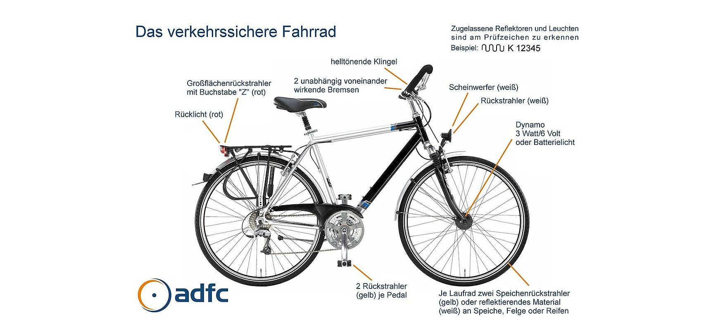

# 交通

## 学期票覆盖的交通

大学注册的费用包含学期票 (Semesterticket) , 凭借这张学期票, 我们可以在本学期在整个莱茵—美茵交通网 (Rhein-Main-Verkehrsverbundes , RMV) 乘坐大多数公共交通工具, 如RB, S-Bahn, U-Bahn和Bus。RMV交通网覆盖了黑森州中部和南部。[学期票的范围](http://bit.ly/3587VSP)

Darmstadt市内的公共交通主要有 Bus 还有 Straßenbahn, 整个市内的交通都被学期票覆盖。交通路线及时间可以通过 RMV APP 查询。

## 火车票

查行程和订票都可以在德国铁路DB主页完成, [Bahn](http://www.bahn.de)。

**特价火车票**

德铁的特价票, 就是平时大家常说的 29.9 欧起的特价票, 短距离路线 (250公里以下) 也有19.9 欧起的。同时还有至少 6 人的团体特价票提供, 票价为 19.9 欧。特价票可在德铁官网的Sparpreis-Finder下, 输入日期, 出发车站和目的车站搜索。

需要注意:

· 越早订特价票越多；  
· 必须指定车次, 如果要更改行程, 在有效期前改签手续费为19欧, 从有效期当日开始则不得改签；  
· 特价票通常可以和BahnCard 25或BahnCard50共同使用, 但都减免25%;  
· 订票过程中两次提到银行卡, 第一次是Identifizierungskarte, 这张是用于乘车时身份验证, 必须是乘车人的名字并且要随身携带。第二次是Zahlung, 这时可以用任意卡支付。假如你自己没有信用卡或其他可以支付的网银, 可以在第一步使用自己Mastero 卡 (比如德意志银行的EC卡) , 第二步借用家人朋友的信用卡。

**周末票 (Schönes-Wochenende-Ticket)**

单人票价44欧元, 每多一个人加6欧, 最多五个人, 票价68 欧, 适用于周六或周日的其中一天。持有者 (票上需至少签一人的名字)   可以在这一天内搭乘德国境内任何区域的短途火车 (2等车厢) 。周末票只能用来乘坐慢车, 当然还可以乘坐市内交通, 比如说公交车和有轨电车 (S-Bahn, U-Bahn) , 如果坐那些跨国界的车, 可以拿票在上车的时候问一下司机。周末票不必提前订, 在站台上DB 的机器上买即可。

**州票 (Länder-Tickets)**

是各个联邦州自己出的火车票。州票适用于一个联邦州内部, 可在一天的时间内搭乘任何慢车, 时间是周一至周五的早上9:00 点到半夜3:00 点以及周六周天0:00 到半夜3:00。

**该买 BahnCard 么？**

学期票只在美因莱茵交通 (RMV) 免费, 如果去学期票范围以外的地方旅行, 为了节省路费, 可以考虑购买BahnCard。持有BahnCard 25所有DB的车票可减免25%；  BahnCard 50对普通车票可打五折, 但特价票只减免25%。BahnCard 适合经常乘坐DB 的人, 可以按需购买。

**如何取消 BahnCard**

无论是哪一种BahnCard, 都需要在有效期结束的6周前取消掉, 不然会续签为下一年的全年卡, 并邮寄账单督促你交钱, 或者直接从你注册过的银行账号中扣钱。所以这项工作, 其实在你收到实体卡的时候就可以着手做了, 防患于未然。最简单的取消的方法是DB 官网上的 [服务中心](http://bit.ly/bahncard-service) 提交申请。也可以Post 寄信, 发Email, 或者火车站的DB 服务中心办理。

## 长途巴士

近几年兴起的长途巴士, 以其低廉的价格, 也越来越受到民众的喜爱, 如欧洲最大的Flixbus  (meinfernbus, Postbus) 等, 站点遍及德国各大城市甚至欧洲其他国家。车票可在线购买[Flixbus](https://www.flixbus.de)　

## 飞机

往返德国中国可以通过一下的渠道购买机票：

- 各大航空公司官网

- 华人旅行社代理

- 携程/飞猪等平台

## 欧洲旅行

在欧洲旅行的话通常可以使用天巡和Omio这两个APP查询和购买机票, 经常会有一些较为特价的机票甚至有9.9欧的廉价机票。

## 自行车

自行车作为平时代步或者闲暇去周边郊游的工具都是很理想的。尤其亚Darmstadt市中心不是很大, 所以一般骑自行车会比搭公交还来得快, 而且也可以免除查车次和等车的时间。

### 德国自行车规定

德国自行车俱乐部网站 [ADFC](http://bit.ly/2LNyWDj) 。  
描述来一辆允许上路的自行车应该具备如下图所示配件：

在德国, 为确保交通安全, 根据道路交通许可规定需要包括一个发光铃, 两个独立制动器和两个防滑且牢固拧紧的踏板, 每个踏板都配有两个向前和向后的黄色反光板的配件。除了刹车之外, 对于道路安全最重要的是自行车灯。这里规定的是白色大灯和红色尾灯。还有另一个是重要的但非强制性的配件, 高品质的锁具, 停车灯系统, 链条防护装置, 坚固的行李架和用于车轮的挡泥板。最好定期检查自行车, 至少每年一次。

### Darmstadt自行车规定

在Darmstadt, 对于自行车的交通有具体的要求和规定, 包括对于交通灯的识别, 自行车行驶和停放的范围 (关于自行车道, 步行区域自行车的行驶问题等) , 携带自行车搭乘公共交通工具的问题, 骑自行车安全头盔的佩戴, Darmstadt路面上不同的标识Mehrzweckstreifen, Zebrastreifen, Fußgängerüberwege, Zweirichtungsradweg, Schutzstreifen。可参考 [DA Fahrrad](http://bit.ly/2Vhnz9Y)。

## 购买

购买自行车有以下途径：

- Ebay上购买二手自行车

- Woograd Darmstadt 可以买到改装好的二手车

- Darmstadt Fahrrad Flohmarkt, 每年9月第一个周日  在Schlossmarkt。

- Zwanig° , 这是达姆学生会组织的, 就在图书馆旁边。那边会有回收的车架, 可以自己另外购买轮胎, 车灯等配件, 然后自己组装单车。  当然也可以在那里利用他们的工具, 修自己的单车! 他们工具齐全, 使用不收费, 可以适当地捐赠。

### 租车

达姆的共享单车有DB提供的 Call a Bike, 达姆有很多停车点. 根据学生会和德铁的协议学生可以免费无限次骑60min以内, 可参考学生会网站, 
[AsTA Bike](http://bit.ly/2InfYB8) 。